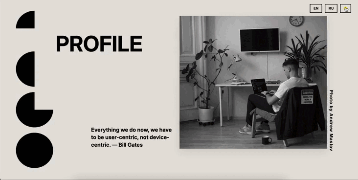

# 💼 Frontend Developer Portfolio

Интерактивное портфолио-приложение, демонстрирующее мои навыки во frontend-разработке.

Основной фокус:
- архитектура приложения  
- работа с TypeScript  
- переиспользуемые компоненты  
- построение UI  

---

## 🌐 Live Demo

👉 https://portfolio-mu-ebon-97.vercel.app/

---

## 📸 Screenshots

### 🖥️ Домашняя страница

<p>Вступительная страница открывает презентацию и представляет разработанное React-приложение</p>

### 🏠 Главная страница

<p>Главная страница с интерактивной навигацией, адаптивным меню и превью проектов.</p>

### 👨‍💻 Обо мне 

<p>Раздел с информацией о моих навыках, опыте и подходе к разработке</p>

### 💡  Проекты

<p>Список проектов с демонстрацией UI, технологий и интерактивных функций</p>

###  ✉️ Контакты 

<p>Форма обратной связи и ссылки на социальные сети</p>

---

## ✨ Key Features & Value

- 📂 **Динамическое отображение проектов**  
  Каждый проект представлен интерактивной карточкой с hover-эффектами, анимацией появления и кликабельными ссылками на репозиторий и демо. Пользователь видит работу UI без лишних действий.  

- 🧠 **Переиспользуемая компонентная архитектура**  
  Компоненты изолированы по назначению (About, Contact, Projects), легко масштабируются и переиспользуются. Это упрощает поддержку и добавление новых функций.  

- 🌙 **Смена темы (light/dark) с сохранением состояния**  
  Реализовано через Context API — пользователь может переключать темы без перезагрузки страницы, состояние сохраняется между сеансами.  

- 🌍 **Локализация (i18n)**  
  Интерфейс поддерживает несколько языков. Переключение языка происходит мгновенно, с плавной подгрузкой текста, что показывает умение работать с динамическим контентом.  

- 📱 **Адаптивный дизайн**  
  Поддержка мобильных и десктоп-устройств с сохранением интерактивности всех элементов.  

- ⚡ **Оптимизированная производительность**  
  Использование Vite и lazy loading компонентов обеспечивает быструю загрузку страниц и минимизацию времени ожидания пользователя.

---

## 🧩 Technical Decisions & Challenges

- **Почему Context API вместо Redux:** проект небольшой, глобальное состояние минимально, поэтому Context API — оптимальное решение без лишней сложности.  

- **Анимации и интерактивность:** hover-эффекты и слайдеры реализованы через CSS transitions и React state, что позволяет сохранять производительность и плавность.  

- **Локализация:** использована библиотека i18next, чтобы динамически подгружать переводы и обеспечить масштабируемость проекта под новые языки.  

- **Адаптивный дизайн:** каждый компонент адаптирован через CSS Modules и media queries, что позволяет изменять стили без конфликтов между разделами.  

- **Оптимизация GIF/скриншотов:** все гифки и изображения сжаты и масштабированы для GitHub README, чтобы сохранить качество и минимальный вес файла.  

- **Главный вызов:** обеспечить плавную анимацию слайдов и hover-эффекты при низком fps, минимизируя вес GIF и обеспечивая читаемость интерфейса.
---

## 🛠 Tech Stack

- React
- TypeScript
- Vite
- SCSS / CSS Modules
- Context API

---

## 🧠 Architecture

Проект организован по компонентному подходу с разделением ответственности:

- components/ — UI-компоненты (About, Contact, Projects, ThemeButton и др.)
- context/ — глобальное состояние (например, тема приложения)
- i18n/ — конфигурация локализации
- api/ — подготовка к работе с внешними данными
- assets/ — статические ресурсы

Подход позволяет:
- изолировать логику
- переиспользовать компоненты
- упростить поддержку

---

## ⚙️ Installation

```bash
git clone https://github.com/taro4kaaaaa/Portfolio.git
cd Portfolio
npm install
npm run dev